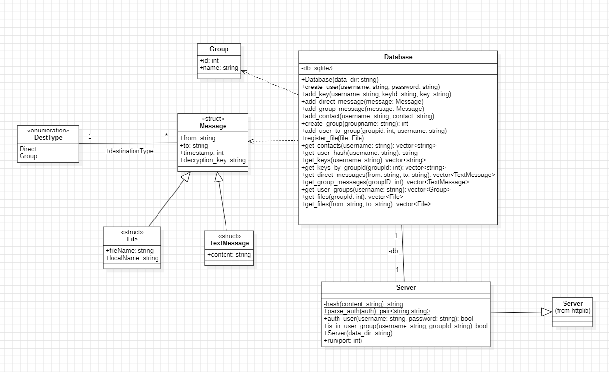
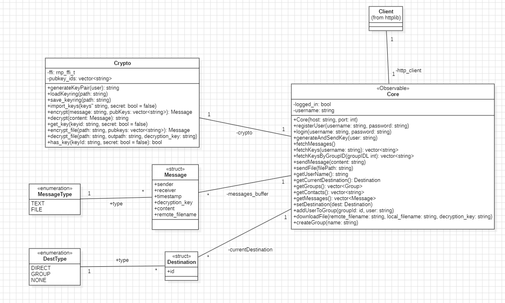
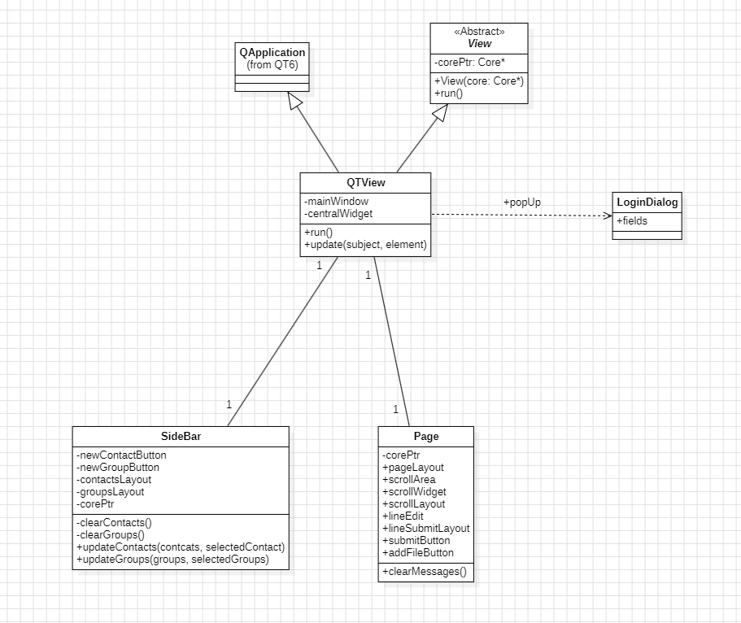
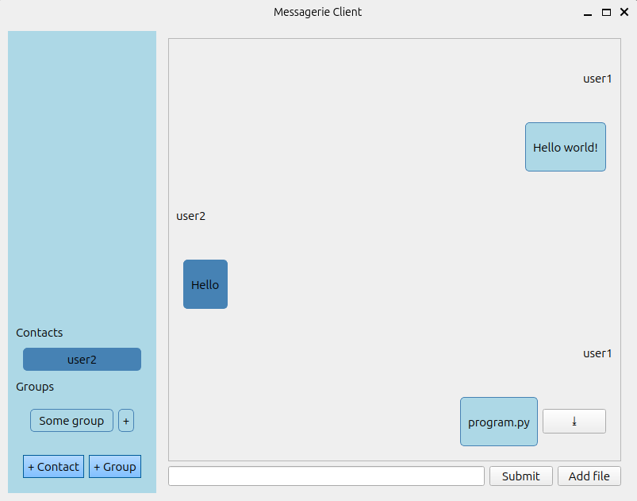

# Instant Messaging Application

## Project description

The instant messaging application aims to provide a communication platform allowing authenticated users to exchange real-time messages (private messages, group messages, attachments) securely and privately through end-to-end encryption.
It is a client-server system developed in C++.  
The application was created by a team and is available in this GitLab repository.
  

---

  

## **The server side :**

The server is based on the RESTful API of an HTTP server. It handles:
  
- Data management: sending and receiving messages to/from clients.
- User management: creating users and groups, authentication (Basic), and storing messages and files.
  
The dependencies used for the server side of the application are:

- cpp-httplib
- SQLite
- json

**Class Diagram of the Server :**


  


### The Database :

The messaging application uses SQLite as its database. This approach facilitates the storage of:

- User accounts and groups
- Contacts
- Conversations and files
- Public keys

An SQL script titled "db_schema.sql" is provided to create the database.

### Instructions

 **Compilation**  

1. Download the dependencies

2. Create the build directory

3. Lunch CMake

4. Compile using the generated Makefile

For example : \

`cd server` \

`mkdir build` \

`cmake ..` \

`make`

### Usage

Create the folders `data` and `data/files` in the directory where the executable will be run. Create the SQLite database `database.db` in the `data` folder using the provided SQL script.

**The folder structure :**
```

.

├── MessagerieServer

└── data/

    ├── database.db

    └── files/

```

**Execution command :**

`./MessagerieServer <port>`

  
--- 

## **The client side :**

The client side consists of a model that includes a web client, which enables communication with the server side through HTTP requests.  
This component is primarily responsible for encrypting user messages and files using cryptographic keys generated by the rnp library and stored on the client's disk.

The dependencies used for the client side of the application are:

- cpp-httplib
- rnp
- Qt6
- json

**Class Diagram of the Client Model :**  


  
## **The view :**

The graphical user interface (GUI) of the application is developed with Qt6. It enables users to perform various actions and is therefore connected to the model.

**Class Diagram of the View :**


  
**Example Use Case of the View :**  



### Instructions

 **Compilation**  

1. Download the dependencies

2. Create the build directory

3. Lunch CMake

4. Compile using the generated Makefile

For example : \

`cd client` \

`mkdir build` \

`cmake ..` \

`make`

### Usage
  

Create the `tmp` and `downloads` folders in the directory where the executable will be run.  
**The folder structure:**  

```

.

├── MessagerieClient

├── tmp/

└── downloads/

```

**Execution command :**

`./MessagerieServer <host> <port>`